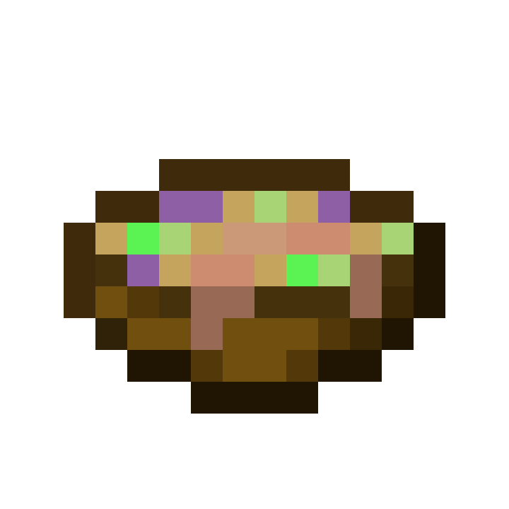

 

  

<h3 align="center">Gravy-Tools</h3>

  

    Набор скриптов с графическим интерфейсом для упрощения строительства. 
    Предназначен для использования билдерами BTE / Team CIS.
     
    <a href="https://github.com/podliva2008/gravy-tools/issues">Жалобы и предложения</a>
  

## О программе

Написана на Python 3.8 для использования в качестве инструмента для упрощения рутинных действий при строительстве. 
На данный момент поддерживает следующие функции:
* Быстрое рисование контуров домов
* Возведение массива домов частного сектора

## Начало работы

В данном разделе описаны необходимые действия по установке и началу использования программы.

### Требования

* Windows 7 или выше (64 бит)
* Minecraft 1.18.2 (должны отсутствовать лаги и фризы)
* Сервер с плагинами [FAWE](https://github.com/IntellectualSites/FastAsyncWorldEdit) 
и [VanillaTerra](https://github.com/vaporrrr/VanillaTerra) 
или [Terra+-](https://github.com/BTE-Germany/TerraPlusMinus)

### Установка

Поскольку у большинства пользователей, вероятнее всего, не установлен Python 3.8, здесь описан порядок его установки.

#### Python 3.8

1. Скачайте установщик по этой ссылке: https://www.python.org/ftp/python/3.8.0/python-3.8.0-amd64.exe

2. Запустите установщик.

3. Проверьте, что две галочки снизу отмечены.

4. Нажмите кнопку **Install Now**.

#### Программа

1. Нажмите на кнопку **Code** вверху страницы, затем на кнопку **Download ZIP**.

2. Распакуйте скачанный архив в удобной вам директории.

3. В распакованной папке запустите файл `install.bat`.

## Использование

Перед началом использования запустите файл `main.py`, откройте Minecraft и зайдите на сервер.

### Взаимодействие с картой

По умолчанию программа запустится без включенной карты.

Чтобы её включить, в левом верхнем углу выберите карту из списка. Вы также можете добавлять свои карты, изменив или добавив нужные параметры в файле `maps.json`.

Если вы запустили программу в первый раз, в поле координат будут стоять координаты частного сектора в Краснодаре. Чтобы перейти к желаемому вам месту, введите желаемые координаты и нажмите кнопку **Обновить**.

Вы можете регулировать масштаб карты когда вам потребуется.

На карте можно рисовать полигоны, чтобы, например, отметить контуры домов, либо выделить весь квартал для его возведения. ЛКМ - поставить точку; ПКМ - сохранить полигон (становится зелёным и его нельзя редактировать); нажатие на колёсико - удаление последней точки либо последнего сохранённого полигона.

### Меры предосторожности при использовании скриптов
В большинстве случаев скрипты работают безотказно, однако их работа может быть нарушена из-за лагов или фризов игры. Даже малейший фриз может серьёзно нарушить работу скрипта. Убедитесь, что игра не лагает и её не фризит.

В случае если была нарушена корректная работа скрипта, поставьте игру на паузу или выйдите на рабочий стол, затем поместите курсор мыши точно в левый верхний угол экрана. Это остановит работу скрипта.

Скрипты работают корректно только на плоском ландшафте.

Наиболее желаемая для работы скриптов высота находится в пределах от -60 до -64 по Y, однако это условие не является обязательным и зависит от ваших намерений.

Скрипты не будут работать на сервере TeamCIS, так как на нём установлен анти-спам.

### Скрипт на контуры
Переносит контуры нарисованных на карте полигонов в игру.

Порядок действий:

1. Выделите полигонами очертания зданий. Не забудьте сохранить каждый сделанный вами полигон, и при необходимости исправлять их если они были нарисованы неправильно.

2. Нажмите кнопку **Контуры**. Наблюдайте за работой скрипта.

### Скрипт на дома
Возводит массив зданий частного сектора (1-3 этажа в высоту).

Порядок действий:

1. Постройте контуры зданий. Найдите и исправьте контуры, которые соприкасаются. В противном случае дома будут построены с неправильными крышами.

2. Окрасьте контуры в блок стены, расставьте блоки крыш внутри контуров каждого здания (примечание: если блоков крыш слишком мало, крыша поломается). По умолчанию набор стен и крыш такой:

Однако вы можете сделать свой набор крыш и стен в файле `config.json`.
После всех расстановок массив зданий должен выглядить примерно так:

3. Если высота какого-либо здания составляет два или три этажа, то под блоком крыши поставьте золотые блоки (2 золотых блока - 2 этажа соответственно, 3 золотых блока - 3 этажа). Пример для двухэтажных домов:

4. Сохраните ваши контуры в отдельном схематике. В случае если скрипт сломается, вы всегда сможете восстановить контуры.

5. Выделите на карте полностью массив нужных вам зданий одним полигоном.

6. Нажмите кнопку **Дома**. Наблюдайте за работой скрипта.

Примечание: ни в коем случае не делайте скриптом здания требующие детализации или этажностью 4 этажа или выше. Такие дома стройте самостоятельно. 

## Помощь в разработке

Помощь в разработке приветствуется. Для жалоб и предложений используйте [раздел Issues](https://github.com/podliva2008/gravy-tools/issues). 
Если вы хотите дополнить и/или улучшить что-либо в коде, воспользуйтесь [разделом Pull requests](https://github.com/podliva2008/gravy-tools/issues).

## Контакты

Здесь указаны никнеймы Discord.

* Создатель программы - По всем вопросам - podliva_2008
* Тестировщик - По вопросам использования - criffane14

## Благодарности

* Brigart - предоставление скрипта на возведение массива домов частного сектора на 1.12.2
* Criffane14 - тестирование и выявление багов и ошибок, оказание помощи пользователям скрипта